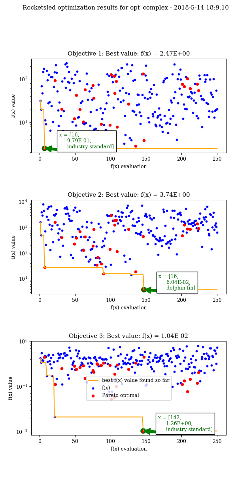

*Tutorial 2 requires some knowledge of Fireworks. If you aren't comfortable with Fireworks, please work through the tutorials* `here <https://hackingmaterials.lbl.gov/fireworks/>`_.

=======================================
Advanced Tutorial - 15-20 min
=======================================

**Real optimization problems are messy**; often, there is a mixture of continuous (floating point),
discrete (integer), and categorical dimensions. The search space may be discontinuous, where only certain combinations of inputs are allowed.
The objective function might have multiple, competing
objectives to optimize. It may be unclear which predictors - that is, the
algorithms that use previous inputs and outputs to suggest the next guess - will be effective, and whether their
training or prediction itself be computationally prohibitive. Furthermore, the way we label points for human
interpretation might have little use for prediction, but features derived from these labels might be very useful for learning.

OptTask has optional arguments which address each of these issues. A few are listed here, and the rest are in the comprehensive guide. For the most part, they are designed to work both in combination and independently.

In this tutorial, we will explore some of the more advanced capabilities of OptTask, including:

* Multiobjective optimiation
* Changing predictors
    + Acquisition functions for improving performance
    + Reducing prediction time
    + Customizing exploration
* Using z (extra) features

Defining the Problem
---------------------
Let's imagine we are designing a fin for a new rocket. **We have three parameters we can tune**:

* Fin length - Defined between 16cm - 145cm
* Fin angle - Defined between 0.0 - 90.0 degrees
* Fin type - Either industry standard, dolphin, or shark type.

**We'll say a good fin has 3 characteristics (objective metrics)**:

* Low cost
* Low drag
* Low probability of failure

We evaluate the performance of a candidate design by nondeterministically simulating the aerodynamics and market performance with an expensive simulation.
A mock version of such a simulation is found in :code:`ComplexMultiObjTask` in :code:`/examples/tasks.py`.

Creating the Workflow
---------------------

The workflow we are creating is two Fireworks; one containing the simulation, and one containing OptTask.

.. image:: _static/multiobj_fws.png
   :alt: mutliobj_fws
   :width: 800px
   :align: center

The y written to the spec by the simulation firework is a list, not a scalar as in previous examples. OptTask will automatically consider this a multi-objective optimization.

Note that **OptTask can go anywhere in your workflow as long as it can read _x_opt and _y_opt from the spec!**
*In this example, the first firework passes the required _x_opt and _y_opt keys to the optimization firework with the FWAction update_spec arg.*

The code we use to define the workflow creator is similar to that found in the quickstart and basic tutorials:

.. code-block:: python

    from fireworks.core.rocket_launcher import rapidfire
    from fireworks import Workflow, Firework, LaunchPad
    from rocketsled import OptTask
    from rocketsled.examples.tasks import ComplexMultiObjTask

    def wf_creator(x):
        X_dim = [(16, 145), (0.0, 90.0), ["industry standard", "shark fin", "dolphin fin"]]
        simulation = Firework([ComplexMultiObjTask()], spec={'_x_opt': x}, name="simulation")
        optimization = Firework([OptTask(wf_creator='rocketsled.examples.complex.wf_creator',
                                 dimensions=X_dim,
                                 host='localhost',
                                 port=27017,
                                 opt_label="opt_complex",
                                 acq="maximin",
                                 predictor="GaussianProcessRegressor",
                                 get_z='rocketsled.examples.complex.get_z',
                                 name='rsled')],
                        name="optimization")
        return Workflow([simulation, optimization], {simulation: optimization})

    def get_z(x):
        fin_len = x[0]
        fin_angle = x[1]
        useful_feature1 = fin_len + fin_angle ** 2
        useful_feature2 = fin_angle + fin_len
        return x + [useful_feature1, useful_feature2]

The new arguments to OptTask are:

* :code:`predictor` - A different built in predictor is used for this optimization. A full list of builtin predictors (and guide for using custom predictors) is shown in the comprehensive guide.
* :code:`acq` - Acquisition functions help us get better results during optimization (generally) than pure exploitation, but may be more computationally intensive. The acquisition function used here is specifically for multi-objective optimization; for single objectives, check the comprehensive guide.
* :code:`n_searchpts` - Tuning the number of points for prediction affects optimizer performance and computational efficiency (the two are often inversely correlated). Also use :code:`n_trainpts` to restrict the number of points used for training from completed runs.
* :code:`get_z` - Encapsulate empirical knowledge with get_z. From physical laws, we postulate two useful features, which we put in a vector called "z". When :code:`get_z` is enabled, x is only used as a label (**not for learning**), unless explicitly returned by get_z. In this case, x might be useful for learning, so we'll return it.

We can launch 250 optimization loop runs with:

.. code-block:: python

    def run_workflows():
        TESTDB_NAME = 'rsled'
        launchpad = LaunchPad(name=TESTDB_NAME)
        launchpad.reset(password=None, require_password=False)
        launchpad.add_wf(wf_creator([60, 45.0, "industry standard"]))
        rapidfire(launchpad, nlaunches=500, sleep_time=0)

    if __name__ == "__main__":
        run_workflows()

Examining results
-----------------------------

.. code-block:: python

    from fireworks import LaunchPad
    from rocketsled import visualize

    lpad = LaunchPad(host='localhost', port=27017, name='rsled')
    visualize(lpad.db.opt_complex, print_pareto=True, scale='log', showmean=False)

There is some useful stdout produced by :code:`visualize`, including a complete list of the optimal objective value points (meaning non-dominated in any given objective), also known as the **Pareto Frontier**.
The points on the Pareto frontier need not have the minimum values for any one of the objectives; however, the absolute best found values for each objective are shown as well.

.. code-block:: bash

    min(f(x)) objective 0 is 2.4716663906 at x = [16, 0.9794468723495431, u'industry standard']
    min(f(x)) objective 1 is 3.74337173135 at x = [16, 0.06040480720271191, u'dolphin fin']
    min(f(x)) objective 2 is 0.0104429576126 at x = [142, 1.2608356066742255, u'industry standard']

    Problem dimension:
        * X dimensions (3): [<type 'int'>, <type 'float'>, <type 'unicode'>]
        * Z dimensions (5): [<type 'int'>, <type 'float'>, <type 'unicode'>, <type 'float'>, <type 'float'>]
    Only Z data is being used for learning.
    Number of Optimizations: 250
    Optimizers used (by percentage of optimizations):
        * 100.00%: GaussianProcessRegressor with acquisition: Maximin Expected Improvement using 3 objectives
    Number of reserved guesses: 1
    Number of waiting optimizations: 0
    DB not locked by any process (no current optimization).

    Pareto Frontier: 30 points
    f(x) = [2.471666390596957, 27.48238986848395, 0.4448868032547827] @ x = [16, 0.9794468723495431, u'industry standard']
    f(x) = [93.01859724025691, 1623.9392203207517, 0.11086881838942292] @ x = [116, 13.26932017507497, u'industry standard']
    f(x) = [20.263988323874553, 405.15607152348605, 0.25007134344442905] @ x = [49, 6.227551501995968, u'shark fin']
    f(x) = [12.127316307413249, 226.5705263013419, 0.28016039923073677] @ x = [37, 4.284994178298564, u'shark fin']
    f(x) = [42.32583374856372, 394.0840359770293, 0.23860336541319574] @ x = [76, 3.3002668184681063, u'industry standard']
    f(x) = [19.790663261912012, 700.4097477732201, 0.26463786067587647] @ x = [47, 15.546544052561718, u'shark fin']
    f(x) = [10.2168227961067, 130.60557338489392, 0.2872835850667972] @ x = [34, 2.153086684368809, u'shark fin']
    f(x) = [56.85262300070313, 436.41896887230035, 0.15027333987286837] @ x = [87, 2.429843874399414, u'shark fin']
    f(x) = [72.38543355551161, 191.62631972759323, 0.22769551246826705] @ x = [79, 1.3306954053381337, u'dolphin fin']
    f(x) = [36.08999149122292, 852.5869436000326, 0.2072757141556187] @ x = [67, 10.950527222513989, u'shark fin']
    f(x) = [4.183289647037304, 34.99182801945318, 0.32071198427784786] @ x = [21, 0.6944844687799834, u'shark fin']
    f(x) = [6.228008499929818, 67.91202551642581, 0.30783624358171] @ x = [26, 1.294856929696876, u'shark fin']
    f(x) = [8.973748107281045, 39.19531111781273, 0.29224810030963994] @ x = [32, 0.3810165150936706, u'shark fin']
    f(x) = [2.527642158007039, 15.702700032050892, 0.3336259028104275] @ x = [16, 0.3355654235898753, u'shark fin']
    f(x) = [8.7308090242463, 142.19720382324883, 0.29521862570256696] @ x = [31, 2.906278222483265, u'shark fin']
    f(x) = [126.20031698441441, 3019.484417324195, 0.05251518595418252] @ x = [133, 21.540269010022485, u'shark fin']
    f(x) = [116.07496718360396, 1849.7972768675982, 0.05863417948265865] @ x = [131, 12.953946970009913, u'industry standard']
    f(x) = [46.77918527129666, 1253.2940813234145, 0.186696724157924] @ x = [77, 15.29799176872524, u'shark fin']
    f(x) = [88.88302026836072, 1918.8872308046193, 0.10128441729749994] @ x = [110, 15.250278680499424, u'shark fin']
    f(x) = [7.710723548287516, 118.25680233360677, 0.30028408634821974] @ x = [29, 2.47714858689301, u'shark fin']
    f(x) = [26.685736420234065, 850.9827854258534, 0.2408425996095338] @ x = [56, 15.18143648127198, u'shark fin']
    f(x) = [2.8274978546887954, 18.72563173907369, 0.3310416362821108] @ x = [17, 0.3930853690817204, u'shark fin']
    f(x) = [133.33546429969246, 445.1188547596248, 0.010442957612568495] @ x = [142, 1.2608356066742255, u'industry standard']
    f(x) = [3.8076194945316377, 3.743371731347361, 0.44482781143780603] @ x = [16, 0.06040480720271191, u'dolphin fin']
    f(x) = [76.14424925941366, 483.3414876831859, 0.11141517427055053] @ x = [102, 2.1210371818169915, u'shark fin']
    f(x) = [67.71434523904519, 1284.663645968029, 0.13471025173127132] @ x = [95, 10.799906903283864, u'shark fin']
    f(x) = [102.63207167405578, 874.4375707299264, 0.07717805945487849] @ x = [123, 4.617255237438416, u'industry standard']
    f(x) = [60.94129655936235, 868.258686604232, 0.14422557214075377] @ x = [90, 6.546645334584239, u'shark fin']
    f(x) = [75.7058035188604, 1397.80346543294, 0.11937654419706178] @ x = [101, 10.98190876732162, u'shark fin']
    f(x) = [54.82841730962141, 909.1474088353508, 0.20529359285755197] @ x = [87, 9.260464582964612, u'industry standard']

The parameters :code:`x=[21, 0.6945, 'shark fin']` give a Pareto-optimal output of :code:`f(x)=[4.18, 35.0, 0.32]`, which, while not optimal in any one metric, provide a robust compromise.

See the :doc:`comprehensive guide </guide>` for a full list of options and arguments to OptTask!