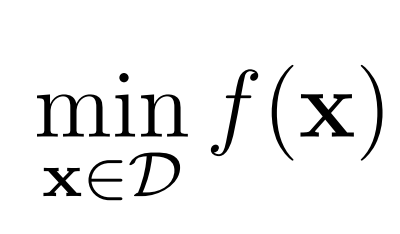
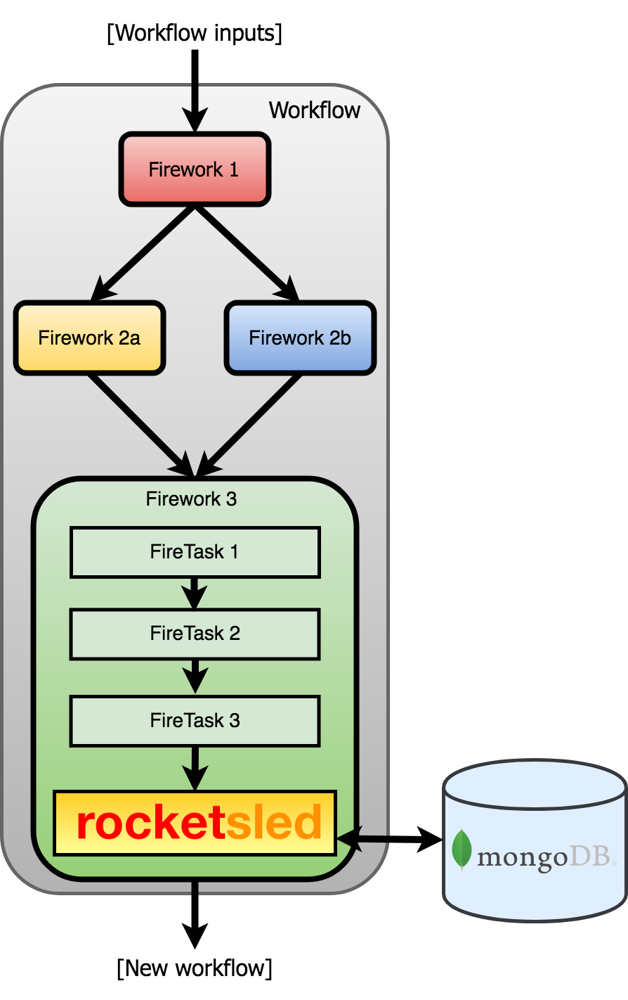

.. title:: rocketsled

.. image:: _static/rsfw.png
   :width: 600 px
   :alt: rocketsled logo
   :align: center

rocketsled is a flexible, automatic
`(open source) <https://github.com/hackingmaterials/rocketsled>`_ adaptive optimization
framework *"on rails"* for high throughput computation. rocketsled is an extension of
`FireWorks <https://github.com/materialsproject/fireworks>`_ workflow software,
written in Python.

There are many packages for adaptive optimization, including `skopt <https://scikit-optimize.github.io>`_ and `pySOT <https://pysot.readthedocs.io/en/latest/>`_. The major aim of rocketsled is to focus on cases where:

* function evaluations are expensive enough that they cannot be run locally, and may instead need to be executed on supercomputing centers (e.g., through a queueing system) or external server
* having a database of provenance for jobs is helpful (e.g., to help re-run error cases)
* one needs to run the optimization over long time scales (days, weeks, months, or even years) with persistence.

For example, the function to optimize might be a complex physics simulation that takes days to run on a parallel supercomputer. Rocketsled helps users run such difficult optimization cases by leveraging the workflow capabilities of the underlying `FireWorks <https://github.com/materialsproject/fireworks>`_ software, which has been used to execute hundreds of millions of CPU-hours of simulations across millions of workflows on many different systems. The optimization algorithm itself can be set by the user or quickly selected from one of the built-in  `skopt <https://scikit-optimize.github.io>`_ optimizers.

=========================
Is rocketsled for me?
=========================
**Is your computational problem:**

1. Expensive and/or complex (require HPC and workflow tools)?
--------------------------------------------------------------
    .. image:: _static/server.png
       :alt: server
       :align: center
       :width: 250px

2. Run in high-throughput (many similar, parallel or serial workflows)?
-----------------------------------------------------------------------
    .. image:: _static/diagram_highthroughput.png
       :alt: dht
       :align: center
       :width: 550px

3. Limited by problem size or allocation?
-----------------------------------------
Want to get the most "bang for your buck" with optimization?
_____________________________________________________________

If you answered yes to these three questions, *keep reading!*

**rocketsled** is an optimization framework which can *automatically* improve the results of your complex, high-throughput tasks using previous results.
It is designed to be as extensible as possible across many computer architectures, optimization schemes, and problem specifications.

============================
What does rocketsled do?
============================

rocketsled functions as a **black box optimizer** for a sequential optimization loop; it solves problems of the form:

rocketsled requires no internal knowledge of f(x) for optimization. rocketsled is designed for problems where each evaluation of f(x) is highly complex, is computationally expensive, requires workflow software, or is all of the above.
**rocketsled is intended to be "plug-and-play": simply plug-in an objective function or workflow f(x) and search domain D, and rocketsled automatically creates an optimization loop in FireWorks which can be easily (and dynamically) managed across arbitray computing resources.**

Features of ``rocketsled``
--------------------------

* **One-line python setup tools**

* Persistent storage and optimization tracking

* **Automatic workflow submission and management with FireWorks**
    + Parallel execution of objective functions on HPC resources
    + Works with many queue systems
    + Several optimization execution schemes

* **Ability to handle complex search spaces, including:**
    + discrete (categorical, integer) dimensions
    + continuous dimensions
    + discontinuous spaces (subsets of entire spaces)

* 10 different built-in sklearn-based tunable Bayesian optimizers
    + single objective
    + **multi objective**

* Support for nearly any custom optimizer written in Python (Bayesian and non-Bayesian)

* Facilitated feature engineering with ``get_z`` argument

* Tuneable control of training and prediction performance, across many kinds of computer resources

* Avoids submitting duplicate workflows, even when workflows run with massive parallelism

* Customization of optimization scheme (sequential, batch, etc.)

* Ability to run optimizations 100% in parallel

* Automatic encoding for categorical optimization

* and more... (see comprehensive guide)

A visual explanation...
-----------------------

A typical workflow f(x) without optimization might look like this:

.. image:: _static/diagram_fireworks.png
   :alt: basicwf
   :align: center
   :width: 250px

Input parameters (x) are given to the first job (Firework). This begins the workflow, and a useful output f(x) = y result is given. The workflow is repeated as desired with different input parameters, often across many compute nodes in parallel, in an attempt to compute favorable outputs.

.. image:: _static/miniwf.png
   :alt: basicwf
   :width: 150px
.. image:: _static/miniwf.png
   :alt: basicwf
   :width: 150px
.. image:: _static/miniwf.png
   :alt: basicwf
   :width: 150px
.. image:: _static/miniwf.png
   :alt: basicwf
   :width: 150px

Randomly selecting the next x to run is *inefficient*, since we will execute many workflows, including those with unfavorable results. To increase computational efficiency, we need to *intelligently* choose new x with an **optimization loop.**

.. image:: _static/diagram_highthroughput2.png
   :alt: basicwf
   :align: center
   :width: 800px

This is where rocketsled comes in handy. rocketsled is a sub-job (FireTask) which can go in any Firework in the workflow, and uses an sklearn-based Bayesian strategy to predict the best *input* parameters for the next iteration, store them in a MongoDB database, and automatically submit a new workflow to compute the next output.

Example use cases
-----------------
rocketsled has many example use cases for adaptive computational problems.

**Searching 19,000 possible for new energy materials using expensive first-principles physics calculations:** rocketsled enabled increased efficiency (wrt. random and empirical rules) in searching a large space of input parameters (materials) for renewable energy water splitting perovskites using Density Functional Theory calculations.

.. image:: _static/3dmap_mend.png
   :alt: 3d
   :width: 500px
.. image:: _static/perovskites_zoomin.png
   :alt: perov
   :width: 500px

**(Forthcoming) Selecting the best machine learning model for large-scale data mining:** rocketsled can be used for selecting the best machine learning models (and their hyperparameters) in cases where each training + cross-validation can be a computationally expensive task.

.. image:: _static/ml.png
   :alt: ml
   :align: center
   :width: 800px

============
Installation
============

Requirements
------------

* Python 2 or 3
* NumPy
* SciPy
* Scikit-learn
* FireWorks
* MongoDB

Install
-------

.. code-block:: bash

    $ # Download the repository and install
    $ git clone https://github.com/hackingmaterials/rocketsled.git
    $ cd rocketsled
    $ pip install -e . -r requirements.txt

Run tests locally
-----------------

.. code-block:: bash

    $ # Make sure the mongod daemon is running as admin
    $ mongod
    $ python setup.py test

Tip: To run tests using a remote launchpad, edit ``/rocketsled/tests/tests_launchpad.yaml``

=========
Tutorials
=========

:doc:`Tutorial 0 - Quickstart </quickstart>`
-----------------------

In the quickstart, we show how to use rocketsled's ``auto_setup`` to get
up and running quickly, starting only with an objective function written in Python.

**Time to complete**: 5 min

:doc:`Tutorial 1 - Basic usage </basic>`
------------------------

*Tutorials 1 and 2 require some knowledge of Fireworks. If you aren't comfortable with Fireworks, please work through the tutorials* `here <https://hackingmaterials.lbl.gov/fireworks/>`_.

In this tutorial we demonstrate how to get a basic optimization loop up and
running with a FireWorks workflow.

**Time to complete**: 5 min

:doc:`Tutorial 2 - Advanced usage </advanced>`
---------------------------

*Tutorials 1 and 2 require some knowledge of Fireworks. If you aren't comfortable with Fireworks, please work through the tutorials* `here <https://hackingmaterials.lbl.gov/fireworks/>`_.

In this tutorial we explore the more advanced capabilities of ``OptTask``.

**Time to complete**: 20 min

:doc:`A Comprehensive Guide to rocketsled </guide>`
---------------------------------------

Find a comprehensive guide to using rocketsled at the link below. The guide
exhaustively documents the possible arguments to ``OptTask`` and provides at least
one example of each. If working through the tutorials did not answer your
question, you'll most likely find your answer here.

Contributions and Support
-------------------------
Want to see something added or changed? Here's a few ways you can!

* Help us improve the documentation. Tell us where you got 'stuck' and improve the install process for everyone.
* Let us know about areas of the code that are difficult to understand or use.
* Contribute code! Fork our `Github repo <https://github.com/hackingmaterials/rocketsled>`_ and make a pull request.

Submit all questions and contact to the `Google group <https://groups.google.com/forum/#!forum/fireworkflows>`_

A comprehensive guide to contributions can be found `here. <https://github.com/hackingmaterials/rocketsled/blob/master/CONTRIBUTING.md>`_

Documentation
-------------

Find the auto-generated documentation :doc:`here </modules>`. Beware! Only for the brave.

