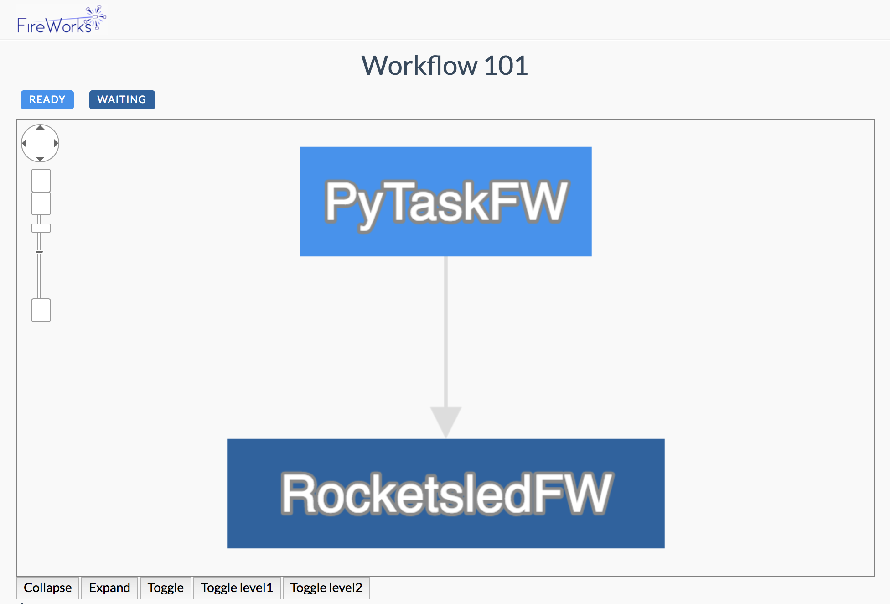

=============================================================
Welcome to the :code:`rocketsled` tutorial! - 30 min required
=============================================================


What you'll need
----------------

1. An expensive objective function (or Fireworks workflow, if you already have it)
2. The search domain of your objective function.
3. A working knowledge of FireWorks (see the `FireWorks <https://github.com/materialsproject/fireworks>`_ docs for a quick refresher, if needed!)


A bird's eye view:
-----------------------------------
This tutorial will walk you through setting up an optimization on your local machine. For more advanced execution options, see the FireWorks documentation and the `comprehensive rocketsled guide </guide.rst>`.


0.**Set up prerequisites** Getting mongodb running, and FireWorks and rocketsled installed.

1.**Create a workflow creator with your objective function and OptTask (optimization task).** Your objective function should take in a list of parameters x, and return a scalar (or list of scalars, if multiobjecive), y. Your workflow should be set up so that the parameters x and y get written to at least one Firework's spec under the keys "_x" and "_y") - if you don't know how to do this, don't worry: we'll walk you through it.

2.**Configure the optimization with rocketsled MissionControl.** OptTask is how rocketsled optimizes your objective function in the workflow. The workflow creator function takes in the input vector x, and returns a workflow (which evaluates your objective function) that calculates y.

3.**Run your optimization** (using FireWorks' LaunchPad).


0. Setting up prerequisites
---------------------------

First, pip install rocketsled:

.. code-block:: bash

    $ pip install rocketsled


This pip install should automatically pip install FireWorks. If it does not, make sure to:

.. code-block:: bash

    $ pip install FireWorks

Last, make sure you have a mongodb instance running locally.

.. code-block:: bash

    $ mongod


1. Writing your objective function with FireWorks
----------------------------------------------------------
The first step is to write the objective function as a workflow in FireWorks. If you already have your objective function written in FireWorks, you can skip this step!

If your objective function is relatively simple, you can put your objective function code in a FireTask, then place that FireTask in a workflow (like we will do in this tutorial).
If your objective function is more complex (i.e., it is dynamic, has multiple jobs or error handling steps, etc.), you should consult the FireWorks documentation.

**The only requirement rocketsled makes on your objective workflow is that the
input and output vectors (x and y) gets written to the spec in two specific fields: "_x", and "_y".**

Below, we write out an example task for a very simple objective function:

.. code-block:: python

    def my_obj_function(x):
        y = x[0] * x[1] / x[2]
        return y


Writing this objective function as a FireTask looks like:

.. code-block:: python

    from fireworks.core.firework import FireTaskBase
    from fireworks.utilities.fw_utilities import explicit_serialize

    @explicit_serialize
    class TutorialTask(FireTaskBase):
    _fw_name = "TutorialTask"

    def run_task(self, fw_spec):
        x = fw_spec['_x']
        y = x[0] * x[1] / x[2]
        return FWAction(update_spec={'_y': y})


*Note that we write the "_y" field to the spec; this is required by rocketsled!*
Now that we have the objective function as a FireTask, we could easily create a workflow in FireWorks; however,
we still need to put our rocketsled optimization in the workflow.


2. Write a workflow creator function and place an OptTask inside.
-----------------------------------------------------------------
Now that we have our objective function defined as a FireTask, we can make a workflow creator function.

The purpose of the workflow creator function is to take in an input vector x, and return a workflow calculating the output values, y.

**Rocketsled requires you place an optimization task ```OptTask``` inside of the workflow creator in the same Firework where the "_x" and "_y" fields are written to the spec.** Below, we write a workflow creator using the FireTask we just wrote.

.. code-block:: python

    from rocketsled import OptTask
    from fireworks import Firework, Workflow

    def my_wf_creator(x):


Great! Now lets define a trivial objective function f(x) for this demo. Your actual objective function will be **much** more complex than this.

.. code-block:: python

    # The objective function must accept a vector and return a scalar/vector.
    def f(x):
        return x[0] * x[1] / x[2]

Define constraints
------------------

Let's constrain this function in each of its dimensions. With rocketsled, each bounded dimension is represented as a 2-tuple for (low, high), and is placed in a list. So if we want to constrain x :sub:`0` to integers between 1-100, x :sub:`1` to integers between 200-300, and x :sub:`3` to floats between 5.0-10.0:

.. code-block:: python

    dimensions = [(1, 100), (200, 300), (5.0, 10.0)]


These constraints ensure the function has a maximum value of 6,000.


Using auto_setup on a function
--------------------------------

Now we can use :code:`auto_setup` to write a file containing

   1. A workflow creator that can:

      a. Run your function in a FireWork

      b. Run the optimization algorithm in a separate FireWork

   2. Commands to launch your workflow.


Lets' maximize our objective function using rocketsled's default predictor, based on scikit-learn's RandomForestRegressor.

.. code-block:: python

    from rocketsled import auto_setup

    # Define the db where the LaunchPad and optimization data will be stored
    # The 'opt_label' field defines the name of the optimization collection
    dbinfo = {"host": "localhost", "name": "my_db", "port": 27017, "opt_label": "quickstart"}

    if __name__ == "__main__":
        auto_setup(f, dimensions, wfname="quickstart", maximize=True, **dbinfo)

.. code-block:: bash

    File successfully created!
    Find your auto sled at /Users/home/rocketsled/rocketsled/auto_sleds/quickstart.py


Check out and run the auto sled
--------------------------------

Let's go to this directory and look at the file, which should look similar to this:

.. code-block:: python

    from __future__ import unicode_literals
    """
    This is an automatically created script from auto_setup.
    If you are not comfortable working with FireWorks and PyTask, do NOT move this
    file out this directory or rename it if you want to run this workflow!

    If you are comfortable working with FireWorks and PyTask, feel free to edit
    and/or move this file to suit your needs. See the OptTask documentation and the
    examples for more information on setting up workflow creators.
    """
    from fireworks import PyTask, Firework, Workflow, LaunchPad
    from fireworks.core.rocket_launcher import rapidfire
    from rocketsled.utils import deserialize, random_guess
    from rocketsled import OptTask


    # This is your function, imported to rocketsled to use with PyTask.
    f = deserialize('/Users/ardunn/quickstart.f')

    def wf_creator(x):
        spec = {'_x':x}
        pt = PyTask(func='rocketsled.auto_sleds.quickstart.f', args=[x], outputs=['_y'])
        ot = OptTask(opt_label='quickstart', dimensions=[(1, 100), (200, 300), (5.0, 10.0)], wf_creator='rocketsled.auto_sleds.quickstart.wf_creator', maximize=True, host='localhost', port=27017, name='my_db')
        fw0 = Firework([pt], spec=spec, name='PyTaskFW')
        fw1 = Firework([ot], spec=spec, name='RocketsledFW')
        wf = Workflow([fw0, fw1], {fw0: [fw1], fw1: []}, name='quickstart @ ' + str(x))
        return wf


    if __name__=='__main__':

        # Make sure the launchpad below is correct, and make changes if necessary if
        # it does not match the OptTask db ^^^:
        lpad = LaunchPad(host='localhost', port=27017, name='my_db')
        # lpad.reset(password=None, require_password=False)

        # Define your workflow to start...
        wf1 = wf_creator(random_guess([(1, 100), (200, 300), (5.0, 10.0)]))

        # Add it to the launchpad and launch!
        lpad.add_wf(wf1)
        # rapidfire(lpad, nlaunches=5, sleep_time=0)

:code:`wf_creator` returns an optimization loop Workflow containing your objective function Firework and the optimization Firework. Then it adds it to the launchpad and launches it!

Your workflow on the launchpad looks like this:



Your objective function is contained in PyTaskFW. The optimization is done in RocketsledFW. When both Fireworks have completed, RocketsledFW launches another workflow based on the next best predicted x value.

Uncomment the :code:`lpad.reset` line if necessary (i.e., if this database is not already a FireWorks db or you don't mind resetting it). Uncomment the last line if you'd like to launch right away! Let's change nlaunches to 100, to run the first 100 Fireworks (50 optimization loops).

.. code-block:: python

    rapidfire(lpad, nlaunches=100, sleep_time=0)


Visualize the optimization results
----------------------------------

Rocketsled comes with a simple function for creating a matplotlib optimization plot.

.. code-block:: python

    from rocketsled import visualize
    from fireworks import LaunchPad

    lp = LaunchPad(host='localhost', port=27017, name='my_db')
    visualize(lp.db.quickstart, maximize=True)

.. image:: _static/quickstart_viz1.png
   :alt: quickstart_viz
   :width: 1200px

The best found value is shown in green.
Although for this basic example we are using relatively few search points (default 1,000) and no acquisition function for the Bayesian optimization (acq=None, default), you should still find that the maximum found is 90-99% of the true maximum, 6,000.


Congrats! We've just worked through the deployment and execution of an entire optimized exploration. For a tutorial on using pre-existing workflows with FireWorks, go :doc:`here. </basic>`